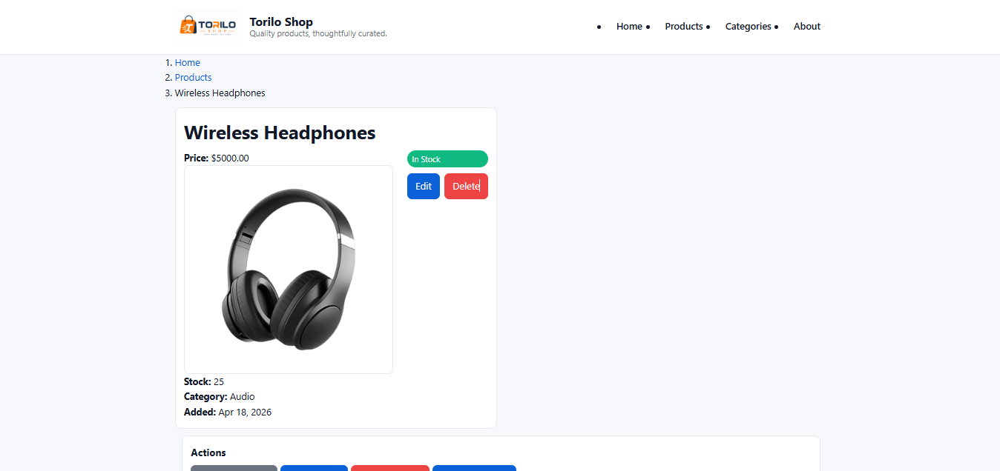
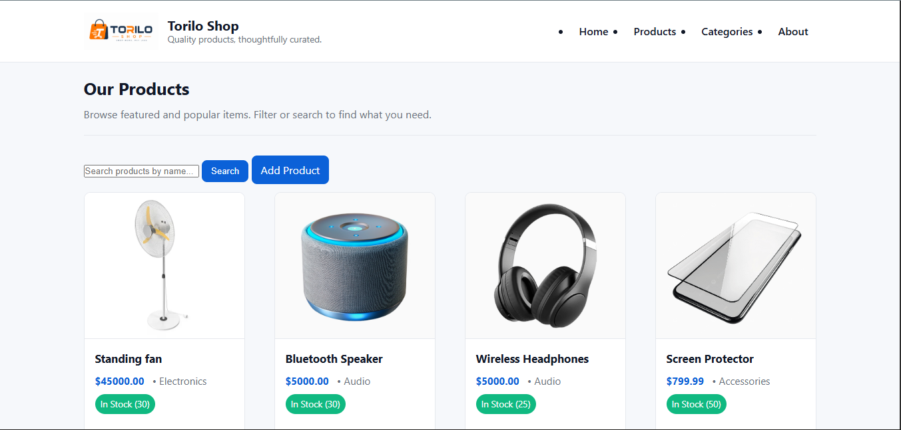
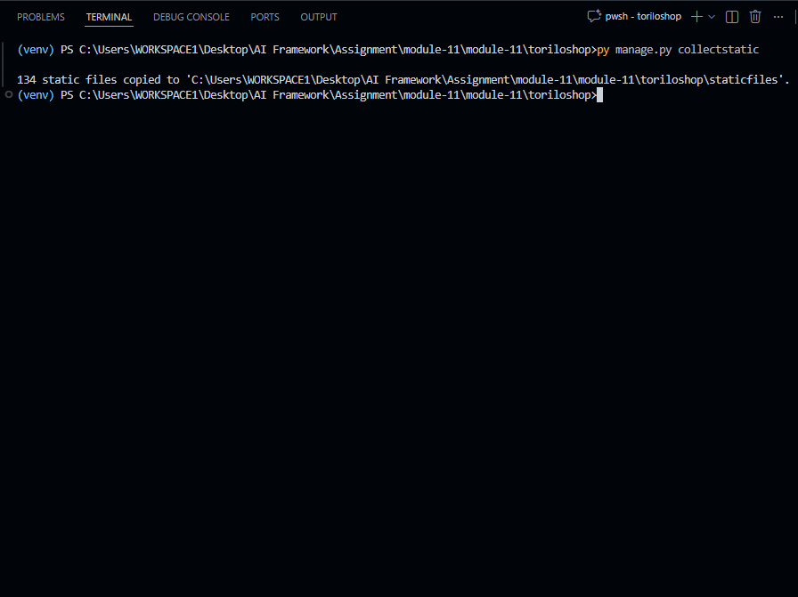

# 🛍️ Torilo Shop - Django E-Commerce (Torilo Shop)

## Project Description

Torilo Shop is a Django-based e-commerce demo focused on a clean, modern product catalog and an improved admin experience. Recent visual and admin improvements include:

- Replaced site-wide Bootstrap usage with a custom responsive CSS (`static/css/main.css`) — grid-based product & category layouts, card-style product tiles, hover/zoom effects and consistent spacing.
- Added `ImageField` support for `Product` with thumbnail display on the list page and full-size image on the detail page (requires Pillow).
- Configured `MEDIA_URL` & `MEDIA_ROOT` and development media serving so uploaded images are available during development.
- Admin enhancements: `ProductAdmin` now shows useful columns (`name`, `price`, `category`, `stock`, `is_available`), includes `search_fields` and `list_filter`, displays image thumbnails in the changelist, and provides a bulk action `Mark as out of stock`.

These changes make the catalog visually professional and make product management faster for site admins.

## Features Implemented

- Visual & CSS
  - Custom responsive stylesheet replacing Bootstrap for product/category pages.
  - Responsive CSS grid (`.products-grid`, `.categories-grid`) with card lift and image hover effects.
- Images
  - `Product.image = models.ImageField(upload_to='products/', blank=True, null=True)` added.
  - Thumbnails on the product list and full images on product detail pages. Placeholder shown when no image is present.
  - `MEDIA_URL` and `MEDIA_ROOT` configured and served in development.
- Admin customisations
  - `ProductAdmin` `list_display`: `name`, `price`, `category`, `stock`, `is_available`, and an `image_tag` thumbnail.
  - `search_fields` and `list_filter` added for quick filtering.
  - Custom admin action `mark_out_of_stock` to mark selected items as out of stock.
- Bulk action
  - Admin bulk action to mark multiple products as out of stock in one operation.

## Setup Instructions

### Step 1: Create and activate a virtual environment (recommended)
```bash
# from project root (module-11/module-11/toriloshop)
python -m venv venv
# Activate (Windows PowerShell)
.\venv\Scripts\Activate.ps1
# macOS / Linux
source venv/bin/activate
```

### Step 2: Install dependencies (include Pillow for ImageField)
```bash
pip install -r requirements.txt  # if you maintain one
# or install main deps directly
pip install django Pillow
```

### Step 3: Create and apply migrations (after changes to models)
```bash
python manage.py makemigrations
python manage.py migrate
```

### Step 4: (Optional) Collect static files for a production-like layout
```bash
python manage.py collectstatic
```

### Step 5: Create a superuser for the admin
```bash
python manage.py createsuperuser
```

### Step 6: Run the development server
```bash
python manage.py runserver
```

Open the site at: http://127.0.0.1:8000/ and the admin at http://127.0.0.1:8000/admin/ (login as a staff/superuser to access the admin features).

## Screenshots

### Product detail (with image)


### Product list (with thumbnails)


### collectstatic output (example)


## Project Structure (high level)

```
module-11/module-11/toriloshop/
├── products/              # products app (models, views, admin, templates)
├── static/                # site CSS and images
├── templates/             # project-level templates
├── media/                 # uploaded media (product images)
├── manage.py
└── README.md
```

## Key Files

- `toriloshop/settings.py` — media and static settings, installed apps
- `products/models.py` — `Product` and `Category` models (ImageField added)
- `products/admin.py` — admin customisations including list_display and bulk actions
- `static/css/main.css` — custom stylesheet replacing Bootstrap for list/detail UI
- `products/templates/products/` — product_list, product_detail and related templates

## Notes

- Image uploads require Pillow to be installed and migrations applied.
- Admin links and thumbnails are visible only to staff/superuser accounts.
- For production, serve media from a proper storage backend and configure static file hosting (e.g., WhiteNoise, CDN).

**Happy learning — open `/admin/` to view the enhanced Product admin list.**
