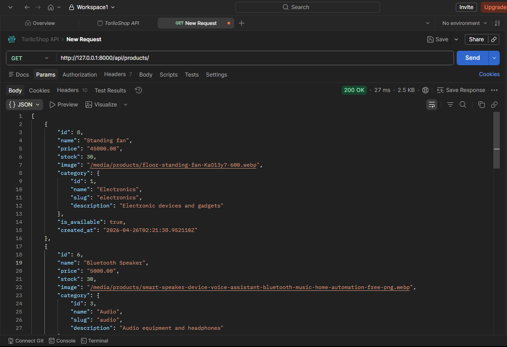
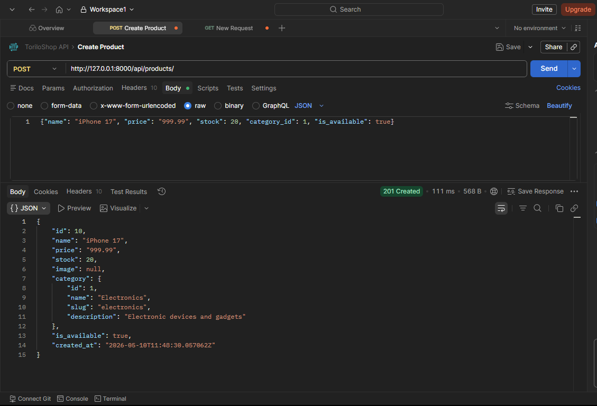
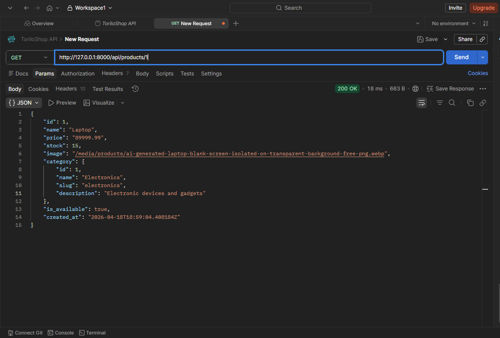
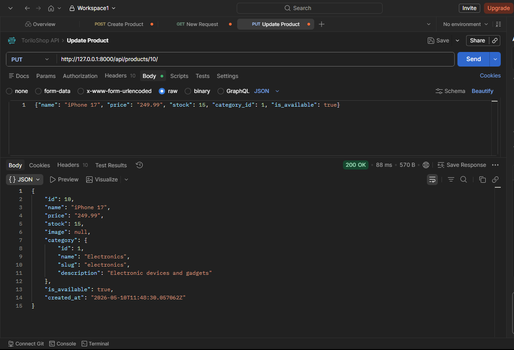
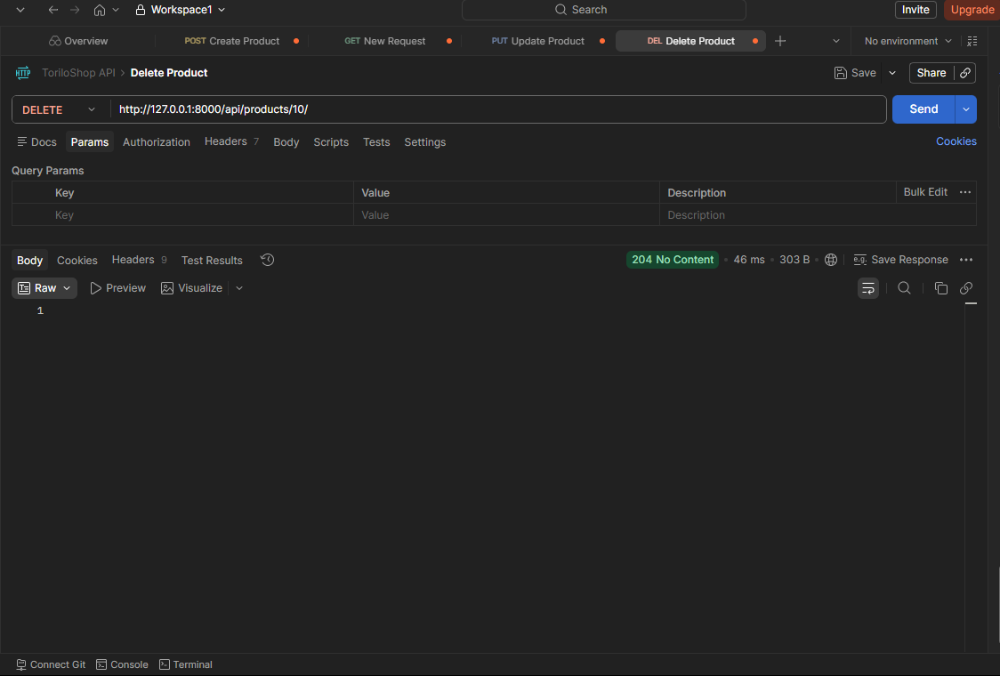
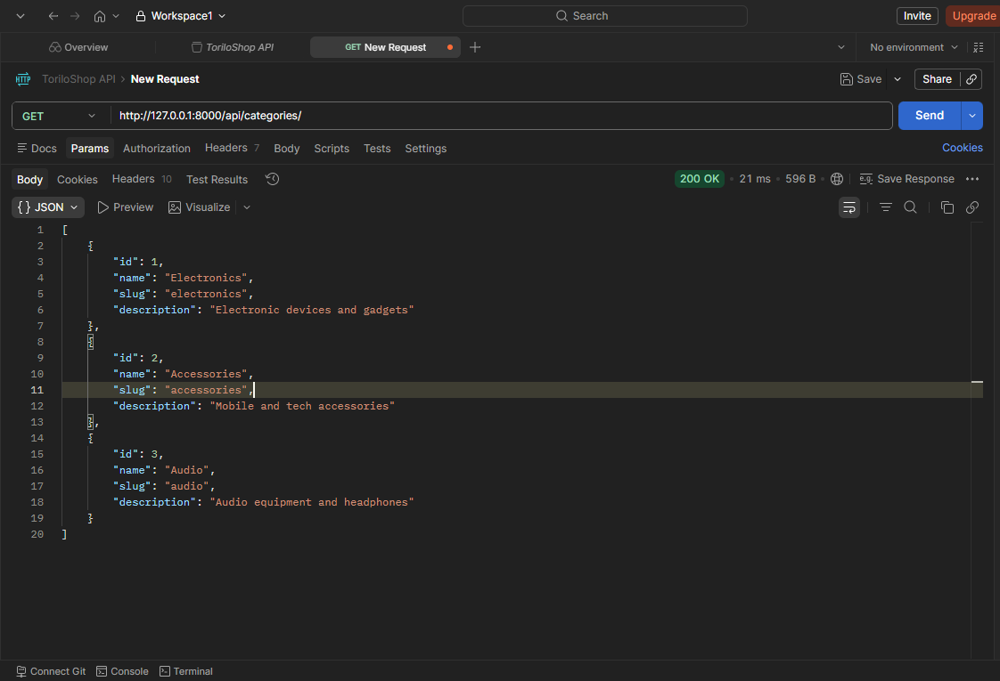

# 🛍️ Torilo Shop — Module 13 (Authentication + REST API)

## Project Description

Torilo Shop is a Django e-commerce demo that now exposes both web pages and REST API endpoints for product and category management. Module 13 adds full authentication flows, protected admin routes, and product/category REST endpoints for API clients.

### API endpoints now exposed

- `GET /api/products/` — list all products
- `POST /api/products/` — create a new product
- `GET /api/products/<id>/` — retrieve a single product by ID
- `PUT /api/products/<id>/` — update a product by ID
- `DELETE /api/products/<id>/` — delete a product by ID
- `GET /api/categories/` — list all categories with nested products

## Features Implemented (Module 13)

### Authentication and UI

- Login (`/accounts/login/`) with a custom login template.
- Logout (`/accounts/logout/`) with client confirmation and redirect to home.
- Registration (`/accounts/register/`) using a custom `RegisterForm` capturing name, username, email, and password.
- Navbar updates to show `Login` / `Register` when logged out and `Hello, <username>` plus `Logout` when logged in.

### Protected web routes

- `product_add`, `product_edit`, and `product_delete` require authenticated users.
- `product_delete` is limited to staff users only.
- Unauthenticated users attempting protected product actions are redirected to login.

### REST API endpoints

- `GET /api/products/` — returns a JSON list of all products with nested category details.
- `POST /api/products/` — accepts JSON to create a product. Use `category_id` to assign a category.
- `GET /api/products/<id>/` — returns a single product's JSON data.
- `PUT /api/products/<id>/` — updates a product using JSON payload.
- `DELETE /api/products/<id>/` — removes a product and returns HTTP 204.
- `GET /api/categories/` — returns category JSON with `product_count` and nested `products`.

## Setup Instructions (run locally)

### 1. Create virtual environment and activate
```bash
# from project root (Assignment/module-13/module-13/toriloshop)
python -m venv venv
# Windows PowerShell
.\venv\Scripts\Activate.ps1
# macOS / Linux
source venv/bin/activate
```

### 2. Install dependencies
```bash
pip install django Pillow djangorestframework
```

### 3. Create and apply migrations
```bash
python manage.py makemigrations
python manage.py migrate
```

### 4. Create a superuser (admin)
```bash
python manage.py createsuperuser
```

### 5. (Optional) Collect static files
```bash
python manage.py collectstatic
```

### 6. Run development server
```bash
python manage.py runserver
```

Open the site at: http://127.0.0.1:8000/ and admin at http://127.0.0.1:8000/admin/

## Test with Postman

Use the API endpoints above and set the `Content-Type` header to `application/json` for POST and PUT requests.

### Retrieve all products
- `GET http://127.0.0.1:8000/api/products/`

### Retrieve a single product
- `GET http://127.0.0.1:8000/api/products/<id>/`


### Create a product
- `POST http://127.0.0.1:8000/api/products/`
- Body example:
```json
{
  "name": "New Product",
  "price": "150.00",
  "stock": 20,
  "category_id": 1,
  "is_available": true
}
```

### Update a product
- `PUT http://127.0.0.1:8000/api/products/5/`
- Body example:
```json
{
  "name": "Updated Product",
  "price": "180.00",
  "stock": 15,
  "category_id": 1,
  "is_available": false
}
```

### Delete a product
- `DELETE http://127.0.0.1:8000/api/products/5/`
- No request body required.

### Retrieve categories
- `GET http://127.0.0.1:8000/api/categories/`

## Screenshots

### 1) GET products


### 2) POST create product


### 3) GET single product


### 4) PUT update product


### 5) DELETE product


### 6) GET categories


## Full Project Structure

```
Assignment/
├── module-13/
│   └── module-13/
│       └── toriloshop/
│           ├── manage.py
│           ├── db.sqlite3
│           ├── README.md
│           ├── requirements.txt (optional)
│           ├── media/                        
│           ├── static/                       
│           │   └── css/main.css
│           ├── staticfiles/                   
│           ├── templates/
│           │   ├── accounts/
│           │   │   ├── login.html
│           │   │   └── register.html
│           │   └── products/
│           │       ├── base.html
│           │       ├── product_list.html
│           │       ├── product_detail.html
│           │       └── ...
│           ├── toriloshop/                   
│           │   ├── settings.py
│           │   ├── urls.py
│           │   └── wsgi.py
│           └── products/                      
│               ├── admin.py
│               ├── apps.py
│               ├── forms.py
│               ├── models.py
│               ├── views.py
│               ├── urls.py
│               └── templates/products/
└── ...
```

## Key Files

- `accounts/forms.py` — `RegisterForm` for new user registrations.
- `accounts/views.py` & `accounts/urls.py` — login/logout/register endpoints.
- `products/views.py` — product CRUD views now protected with `@login_required` and staff-only deletes.
- `products/urls.py` — includes REST API routes and web routes.
- `products/admin.py` — admin customisations for product management.
- `static/css/main.css` — custom UI and auth form styles.

## Notes

- The login/logout flow uses Django auth and client-side logout confirmation. The server `LogoutView` terminates the session and redirects to home.
- The REST API returns JSON responses and uses `category_id` for product create/update requests.
- Ensure `MEDIA_URL`/`MEDIA_ROOT` are configured in `toriloshop/settings.py`, and that Pillow is installed for `ImageField` support.
- For production, configure a proper static/media server, secure settings, and HTTPS.

**This is Module 13 — REST API support plus authentication and admin enhancements.**
