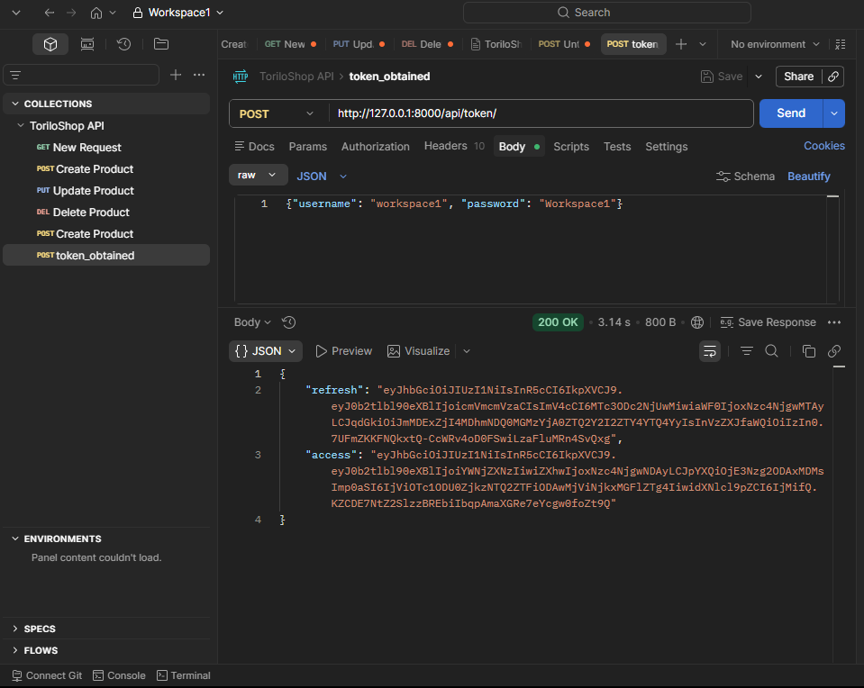
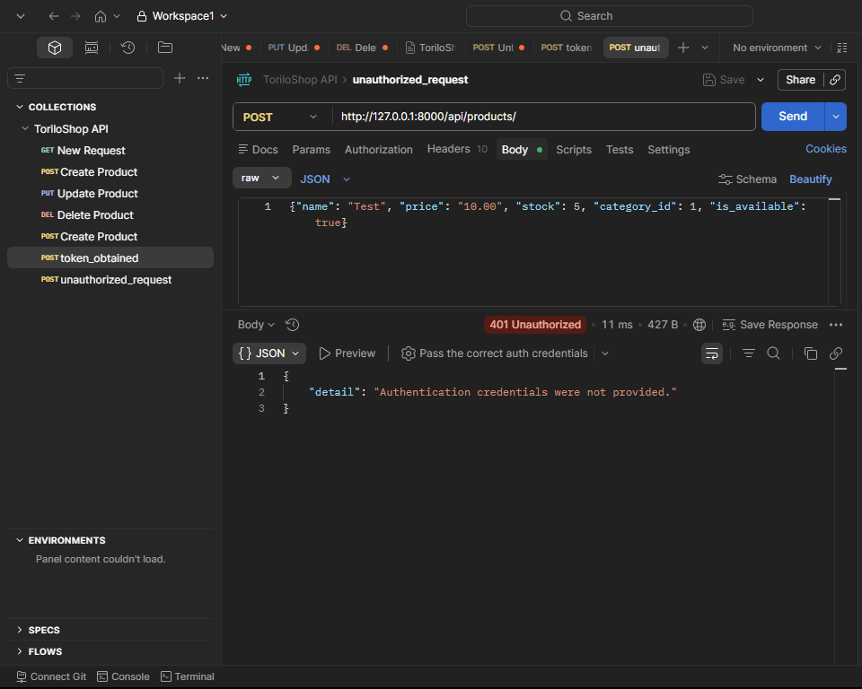
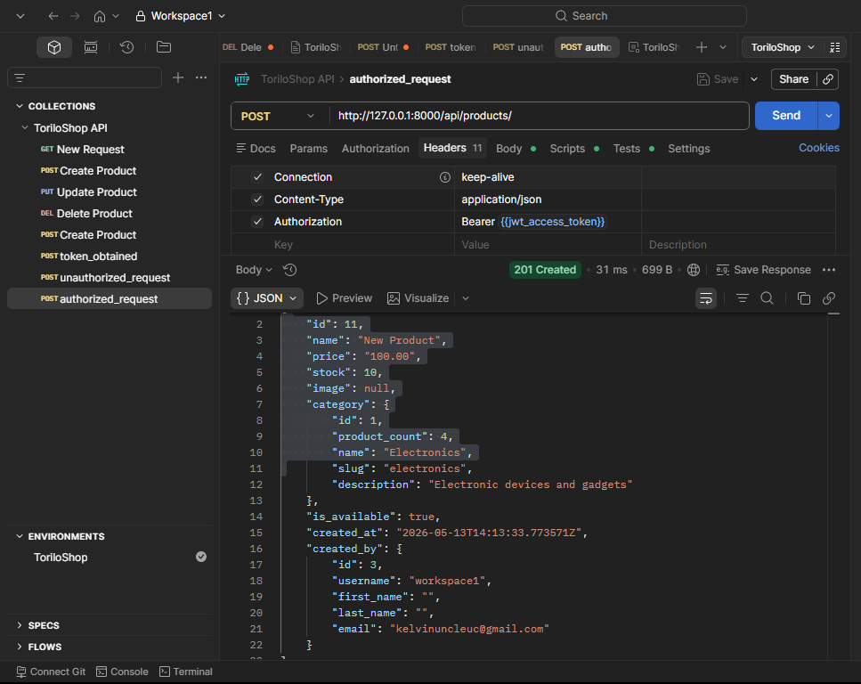
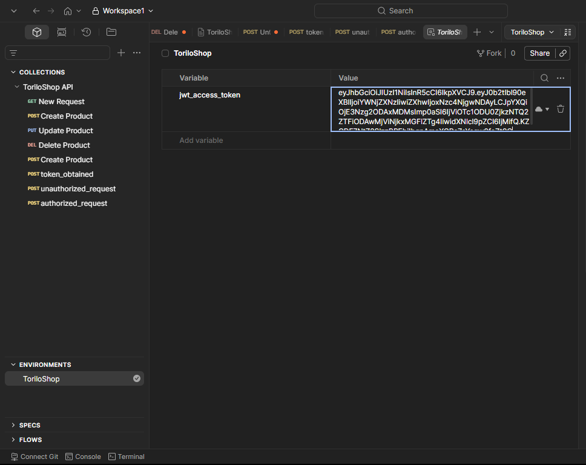
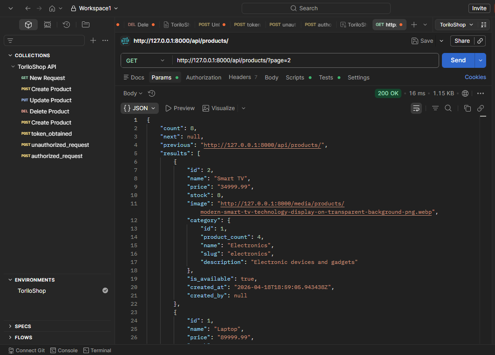
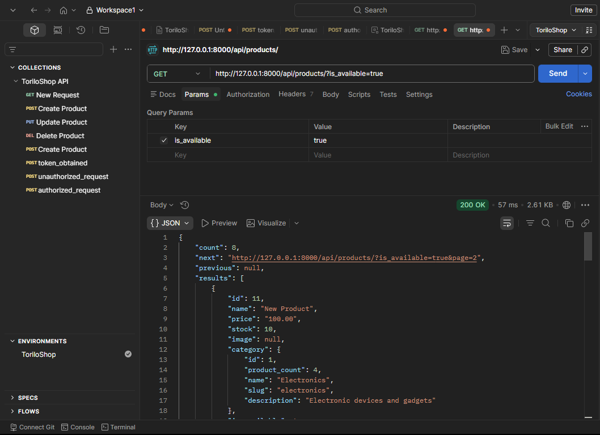

# 🛍️ Torilo Shop — Module 13 (Authentication + REST API)

## Project Description

Torilo Shop is a Django e-commerce demo with both web UI and REST API support. In Module 13, security and API features were added to protect create/update/delete operations, expose JWT token authentication endpoints, and allow cross-origin API access.

### Security and API features added

- Token authentication for API calls using `Authorization: Bearer <access_token>`
- JWT endpoints: `POST /api/token/` and `POST /api/token/refresh/`
- Authenticated API access required for `POST`, `PUT`, and `DELETE` product actions
- `created_by` tracking so users can edit/delete only their own products
- CORS headers enabled to allow requests from any origin
- Web authentication with login, registration, logout, and protected product pages

## Features Implemented

- Token auth
- JWT access and refresh tokens
- CORS support for all origins
- API pagination and web pagination (6 products per page)
- Filtering by category, availability, and search query
- Sorting by date, price, and name
- Protected web routes for add/edit/delete product actions
- Authenticated API product create/update/delete requests

## Setup Instructions

### 1. Create a virtual environment and activate it
```bash
# from project root (Assignment/module-13/module-13/toriloshop)
python -m venv venv
# Windows PowerShell
.\venv\Scripts\Activate.ps1
# macOS / Linux
source venv/bin/activate
```

### 2. Install dependencies
```bash
pip install django Pillow djangorestframework djangorestframework-simplejwt django-cors-headers
```

### 3. Apply database migrations
```bash
python manage.py makemigrations
python manage.py migrate
```

### 4. Create a superuser
```bash
python manage.py createsuperuser
```

### 5. Run the development server
```bash
python manage.py runserver
```

Open the web UI at: http://127.0.0.1:8000/

## Obtain JWT Tokens

### 1. Request access and refresh tokens
- `POST http://127.0.0.1:8000/api/token/`
- Headers: `Content-Type: application/json`
- Body example:
```json
{
  "username": "admin",
  "password": "password123"
}
```

### 2. Refresh the access token
- `POST http://127.0.0.1:8000/api/token/refresh/`
- Headers: `Content-Type: application/json`
- Body example:
```json
{
  "refresh": "<refresh_token>"
}
```

### 3. Use the access token for protected requests
- Header: `Authorization: Bearer <access_token>`

## Test API Endpoints

### Public API endpoints
- `GET http://127.0.0.1:8000/api/products/`
- `GET http://127.0.0.1:8000/api/products/<id>/`
- `GET http://127.0.0.1:8000/api/categories/`

### Protected API endpoints (requires JWT access token)
- `POST http://127.0.0.1:8000/api/products/`
  - Body example:
  ```json
  {
    "name": "New Product",
    "price": "150.00",
    "stock": 20,
    "category_id": 1,
    "is_available": true
  }
  ```
- `PUT http://127.0.0.1:8000/api/products/<id>/`
  - Body example:
  ```json
  {
    "name": "Updated Product",
    "price": "180.00",
    "stock": 15,
    "category_id": 1,
    "is_available": false
  }
  ```
- `DELETE http://127.0.0.1:8000/api/products/<id>/`

## Screenshots

### 1) Token obtained


### 2) Unauthorized request


### 3) Authorized request


### 4) JWT access token


### 5) Paginated response


### 6) Filtered results


## API endpoints now exposed

- `GET /api/products/` — list all products
- `POST /api/products/` — create a new product
- `GET /api/products/<id>/` — retrieve a single product by ID
- `PUT /api/products/<id>/` — update a product by ID
- `DELETE /api/products/<id>/` — delete a product by ID
- `GET /api/categories/` — list all categories with nested products

## Full Project Structure

```
Assignment/
├── module-13/
│   └── module-13/
│       └── toriloshop/
│           ├── manage.py
│           ├── db.sqlite3
│           ├── README.md
│           ├── requirements.txt (optional)
│           ├── media/
│           ├── static/
│           │   └── css/main.css
│           ├── staticfiles/
│           ├── templates/
│           │   ├── accounts/
│           │   │   ├── login.html
│           │   │   └── register.html
│           │   └── products/
│           │       ├── base.html
│           │       ├── product_list.html
│           │       ├── product_detail.html
│           │       └── ...
│           ├── toriloshop/
│           │   ├── settings.py
│           │   ├── urls.py
│           │   └── wsgi.py
│           └── products/
│               ├── admin.py
│               ├── apps.py
│               ├── forms.py
│               ├── models.py
│               ├── views.py
│               ├── urls.py
│               └── templates/products/
└── ...
```

## Key Files

- `accounts/forms.py` — `RegisterForm` for new user registrations.
- `accounts/views.py` & `accounts/urls.py` — login/logout/register endpoints.
- `products/views.py` — product CRUD views now protected with `@login_required` and staff-only deletes.
- `products/urls.py` — includes REST API routes and web routes.
- `products/admin.py` — admin customisations for product management.
- `static/css/main.css` — custom UI and auth form styles.

## Notes

- The login/logout flow uses Django auth and client-side logout confirmation. The server `LogoutView` terminates the session and redirects to home.
- The REST API returns JSON responses and uses `category_id` for product create/update requests.
- Ensure `MEDIA_URL`/`MEDIA_ROOT` are configured in `toriloshop/settings.py`, and that Pillow is installed for `ImageField` support.
- For production, configure a proper static/media server, secure settings, and HTTPS.

**This is Module 13 — REST API support plus authentication and admin enhancements.**
