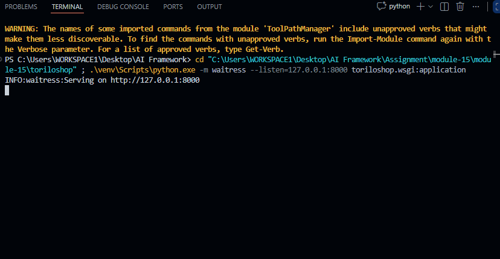
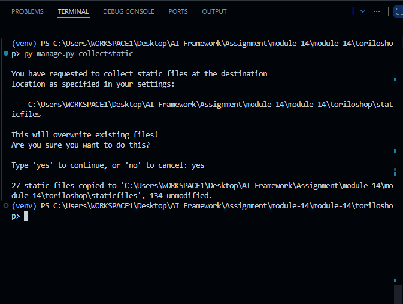
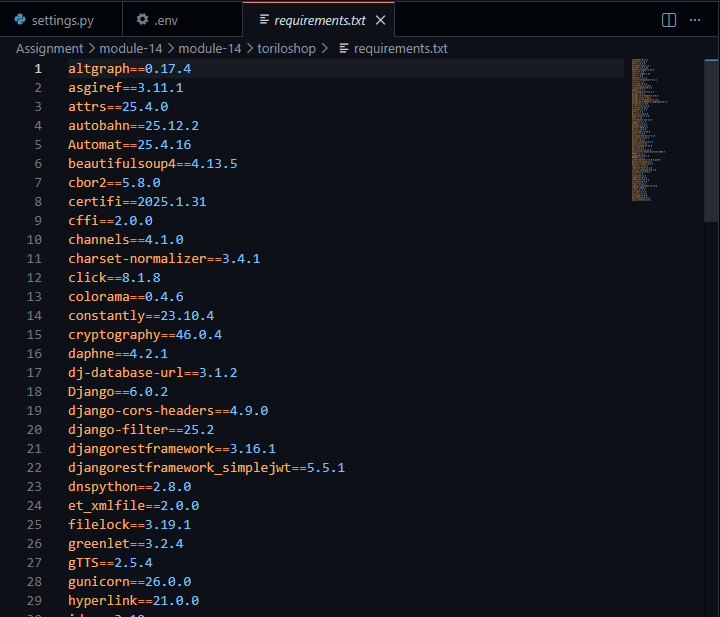
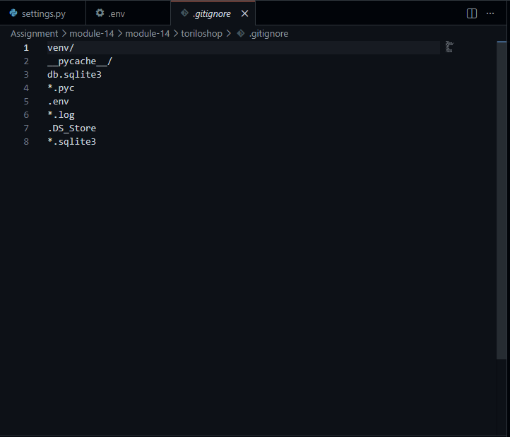

# 🛍️ Torilo Shop — Module 15 (Production Deployment)

## Project Description

Torilo Shop is a Django e-commerce application with full REST API and web UI. Module 15 adds production-ready deployment configuration: environment variables via `.env`, database URL flexibility (SQLite locally, PostgreSQL in production), static file serving with Whitenoise, and application servers (gunicorn for Linux, waitress for Windows testing).

### Production changes made

- Created `.env` file with `SECRET_KEY`, `DEBUG`, `ALLOWED_HOSTS`, and `DATABASE_URL`
- Integrated `python-decouple` to load sensitive values from `.env` at runtime
- Configured `dj-database-url` for flexible database backends (SQLite fallback, PostgreSQL production)
- Added `Whitenoise` middleware and storage backend for static file compression and serving
- Installed `gunicorn` for production WSGI server (Linux/cloud platforms)
- Installed `waitress` for Windows development testing
- Created `Procfile` with gunicorn start command ready for Heroku/cloud deployment
- Generated `requirements.txt` with all dependencies for reproducible installations
- Ensured `.env` is in `.gitignore` and NOT tracked by git

## Features Implemented

- Environment-based configuration using `python-decouple`
- Database URL parsing with `dj-database-url` (SQLite local, PostgreSQL production)
- Static file collection and compression with `Whitenoise`
- Production WSGI server support (`gunicorn` and `waitress`)
- Cloud-ready deployment (`Procfile` for Heroku, PaaS platforms)
- Security: SECRET_KEY, DEBUG, ALLOWED_HOSTS from environment
- Token auth and JWT endpoints
- CORS support
- API pagination, filtering, and search
- Protected web and API routes

## Setup Instructions

### 1. Clone and create virtual environment
```bash
# Windows PowerShell
python -m venv venv
.\venv\Scripts\Activate.ps1

# macOS / Linux
python -m venv venv
source venv/bin/activate
```

### 2. Install dependencies from requirements.txt
```bash
pip install -r requirements.txt
```

### 3. Create .env file in project root
```bash
# Copy and customize:
SECRET_KEY=your-secret-key-here
DEBUG=True
ALLOWED_HOSTS=127.0.0.1,localhost
DATABASE_URL=sqlite:///db.sqlite3
```

### 4. Apply database migrations
```bash
python manage.py makemigrations
python manage.py migrate
```

### 5. Create a superuser
```bash
python manage.py createsuperuser
```

### 6. Collect static files
```bash
python manage.py collectstatic --noinput
```

### 7. Run locally with development server
```bash
python manage.py runserver
```

Or test with production-like WSGI server:

**Windows (waitress):**
```bash
.\venv\Scripts\python.exe -m waitress --listen=127.0.0.1:8000 toriloshop.wsgi:application
```

**Linux/macOS (gunicorn):**
```bash
gunicorn toriloshop.wsgi:application --bind 0.0.0.0:8000 --workers 3
```

### 8. Deploy to production (Heroku, AWS, Azure, etc.)
Most platforms auto-read `Procfile` and use gunicorn to start the app.

## Obtain JWT Tokens

### 1. Request access and refresh tokens
- `POST http://127.0.0.1:8000/api/token/`
- Headers: `Content-Type: application/json`
- Body example:
```json
{
  "username": "admin",
  "password": "password123"
}
```

### 2. Refresh the access token
- `POST http://127.0.0.1:8000/api/token/refresh/`
- Headers: `Content-Type: application/json`
- Body example:
```json
{
  "refresh": "<refresh_token>"
}
```

### 3. Use the access token for protected requests
- Header: `Authorization: Bearer <access_token>`

## Test API Endpoints

### Public API endpoints
- `GET http://127.0.0.1:8000/api/products/`
- `GET http://127.0.0.1:8000/api/products/<id>/`
- `GET http://127.0.0.1:8000/api/categories/`

### Protected API endpoints (requires JWT access token)
- `POST http://127.0.0.1:8000/api/products/`
  - Body example:
  ```json
  {
    "name": "New Product",
    "price": "150.00",
    "stock": 20,
    "category_id": 1,
    "is_available": true
  }
  ```
- `PUT http://127.0.0.1:8000/api/products/<id>/`
  - Body example:
  ```json
  {
    "name": "Updated Product",
    "price": "180.00",
    "stock": 15,
    "category_id": 1,
    "is_available": false
  }
  ```
- `DELETE http://127.0.0.1:8000/api/products/<id>/`

## Screenshots

### 1) Gunicorn running


### 2) Collectstatic output


### 3) Requirements.txt


### 4) Gitignore excludes .env


## API endpoints now exposed

- `GET /api/products/` — list all products
- `POST /api/products/` — create a new product
- `GET /api/products/<id>/` — retrieve a single product by ID
- `PUT /api/products/<id>/` — update a product by ID
- `DELETE /api/products/<id>/` — delete a product by ID
- `GET /api/categories/` — list all categories with nested products

## Full Project Structure

```
Assignment/
├── module-15/
│   └── module-15/
│       └── toriloshop/
│           ├── manage.py
│           ├── db.sqlite3
│           ├── README.md
│           ├── requirements.txt (optional)
│           ├── media/
│           ├── static/
│           │   └── css/main.css
│           ├── staticfiles/
│           ├── templates/
│           │   ├── accounts/
│           │   │   ├── login.html
│           │   │   └── register.html
│           │   └── products/
│           │       ├── base.html
│           │       ├── product_list.html
│           │       ├── product_detail.html
│           │       └── ...
│           ├── toriloshop/
│           │   ├── settings.py
│           │   ├── urls.py
│           │   └── wsgi.py
│           └── products/
│               ├── admin.py
│               ├── apps.py
│               ├── forms.py
│               ├── models.py
│               ├── views.py
│               ├── urls.py
│               └── templates/products/
└── ...
```

## Key Files

- `accounts/forms.py` — `RegisterForm` for new user registrations.
- `accounts/views.py` & `accounts/urls.py` — login/logout/register endpoints.
- `products/views.py` — product CRUD views now protected with `@login_required` and staff-only deletes.
- `products/urls.py` — includes REST API routes and web routes.
- `products/admin.py` — admin customisations for product management.
- `static/css/main.css` — custom UI and auth form styles.

## Notes

- The login/logout flow uses Django auth and client-side logout confirmation. The server `LogoutView` terminates the session and redirects to home.
- The REST API returns JSON responses and uses `category_id` for product create/update requests.
- Ensure `MEDIA_URL`/`MEDIA_ROOT` are configured in `toriloshop/settings.py`, and that Pillow is installed for `ImageField` support.
- For production, configure a proper static/media server, secure settings, and HTTPS.

**This is Module 15 — REST API support plus authentication and admin enhancements.**
