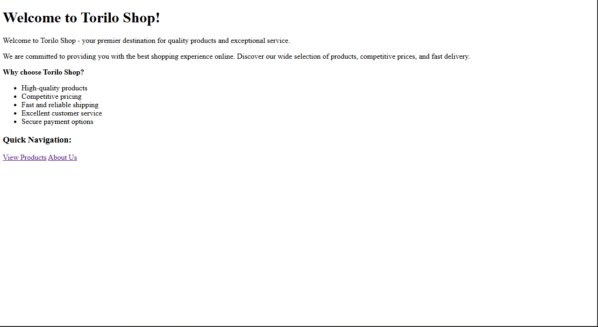
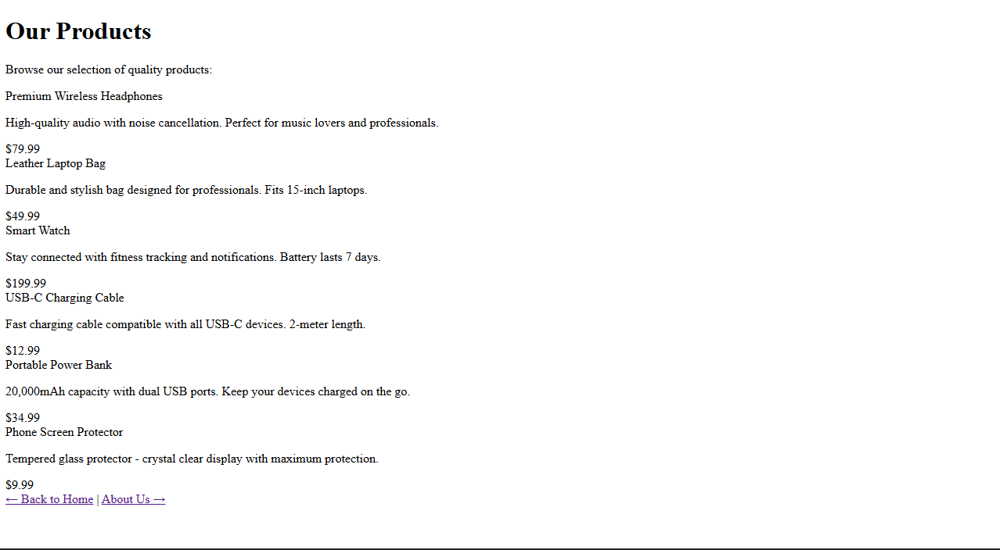
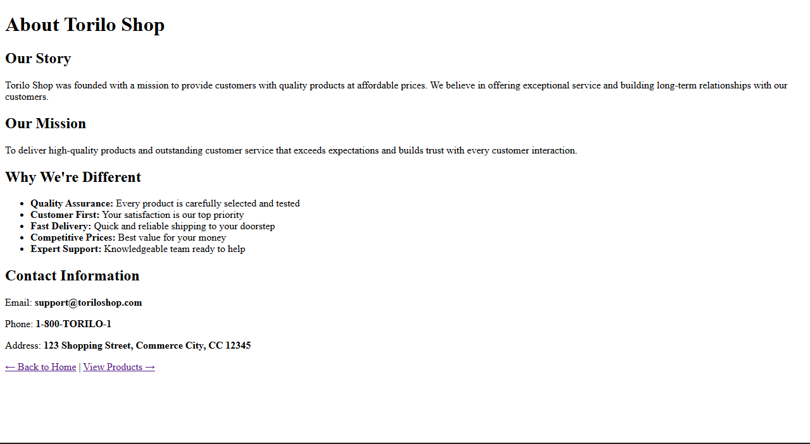

# 🛍️ Torilo Shop - Django E-Commerce Project

## Project Description

**Torilo Shop** is a beginner-friendly Django e-commerce web application designed to demonstrate core Django concepts. It serves as a functional online retail storefront where customers can browse products, learn about the company, and explore different pages of the website.

The project showcases:
- Django project structure and app architecture
- URL routing and view functions
- HTTP responses with styled HTML
- Navigation between pages
- Custom error handling (404 page)

## Features Implemented

### Views Created
1. **home()** - Welcome/landing page with introduction and quick navigation
2. **product_list()** - Display all available products with prices
3. **about()** - Company information, mission, and contact details
4. **page_not_found()** - Custom 404 error handler for missing pages

### URL Routes
| URL | View | Purpose |
|-----|------|---------|
| `/` | home() | Home page |
| `/products/` | product_list() | Products listing |
| `/about/` | about() | About page |
| (Any invalid URL) | page_not_found() | 404 error page |

### Apps Registered
- `products` - Main commerce app containing views and URLs
- `users` - User management app (placeholder for future development)

## Setup Instructions

### Step 1: Create Virtual Environment
```bash
# Navigate to the project directory
cd Kelvin_Ordu_Module7/toriloshop/

# Create a virtual environment
python -m venv venv

# Activate the virtual environment
# On Windows:
.\venv\Scripts\Activate.ps1
# On macOS/Linux:
source venv/bin/activate
```

### Step 2: Install Django
```bash
# Install Django
pip install django
```

### Step 3: Run the Development Server
```bash
# Start the Django development server
python manage.py runserver
```

The server will start at: **http://127.0.0.1:8000/**

### Step 4: Access the Application
Open your web browser and visit:
- **Home Page:** http://127.0.0.1:8000/
- **Products:** http://127.0.0.1:8000/products/
- **About:** http://127.0.0.1:8000/about/

### To Stop the Server
Press `CTRL + C` in the terminal

## Project Structure

```
Kelvin_Ordu_Module7/
├── toriloshop/                  # Project configuration folder
│   ├── settings.py             # Settings with INSTALLED_APPS
│   ├── urls.py                 # Root URL configuration
│   ├── wsgi.py
│   └── asgi.py
├── products/                    # Products app
│   ├── views.py                # All view functions
│   ├── urls.py                 # URL patterns for products app
│   ├── models.py
│   ├── admin.py
│   ├── apps.py
│   ├── tests.py
│   └── migrations/
├── users/                       # Users app (empty)
│   └── ...
├── manage.py                    # Django management script
├── db.sqlite3                   # SQLite database
├── venv/                        # Virtual environment
├── screenshots/                 # Project screenshots
└── README.md                    # This file
```

## Screenshots

### Home Page


### Products Page


### About Page


## Key Files

### settings.py
- Location: `toriloshop/settings.py`
- Registered apps: `'products'` and `'users'`
- DEBUG mode enabled for development

### products/views.py
Contains four view functions:
- `home()` - Returns welcome page with navigation
- `product_list()` - Returns product catalog
- `about()` - Returns company information
- `page_not_found()` - Custom 404 error handler

### products/urls.py
Maps URLs to views:
```python
path('', views.home, name='home')
path('products/', views.product_list, name='product_list')
path('about/', views.about, name='about')
```

### toriloshop/urls.py
Root URL configuration that includes products app URLs and sets up custom 404 handler

## Technologies Used

- **Python 3.x**
- **Django 6.0.4**
- **SQLite** (default database)

## Learning Topics Covered

✅ Django project structure  
✅ Creating Django apps  
✅ Function-based views  
✅ URL routing with `path()`  
✅ Returning HTTP responses with HTML  
✅ Navigating between pages  
✅ Custom error handling (404)  
✅ Using INSTALLED_APPS configuration  

## Notes

- This is a development server and should NOT be used in production
- The application uses inline HTML in views for simplicity
- No database models are currently used
- No static files (CSS, JS) are configured yet

## Future Enhancements

- Add templates directory for proper HTML organization
- Implement database models for products and users
- Add CSS styling with static files
- Implement user authentication
- Add shopping cart functionality
- Integrate payment processing

## Author

Created as an educational Django learning project for Module 7

---

**Happy Learning! 🚀**
